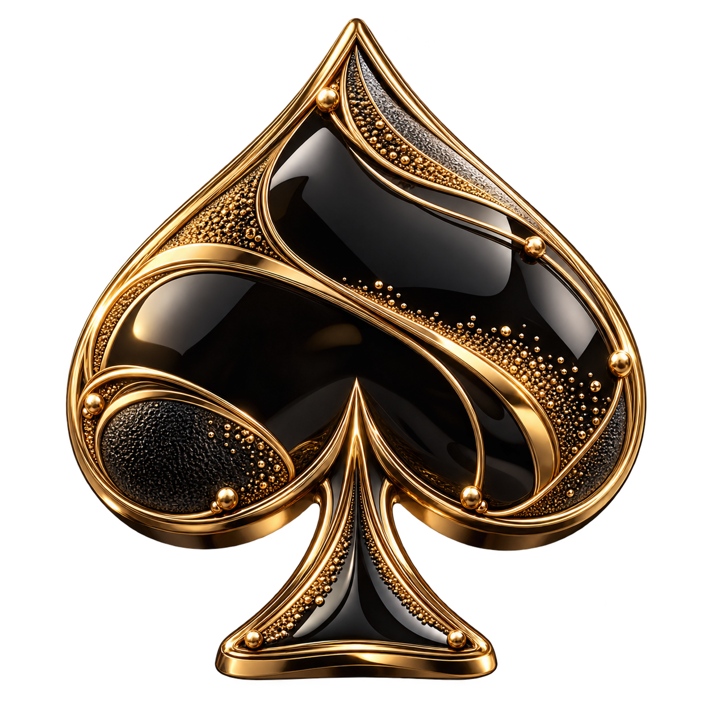
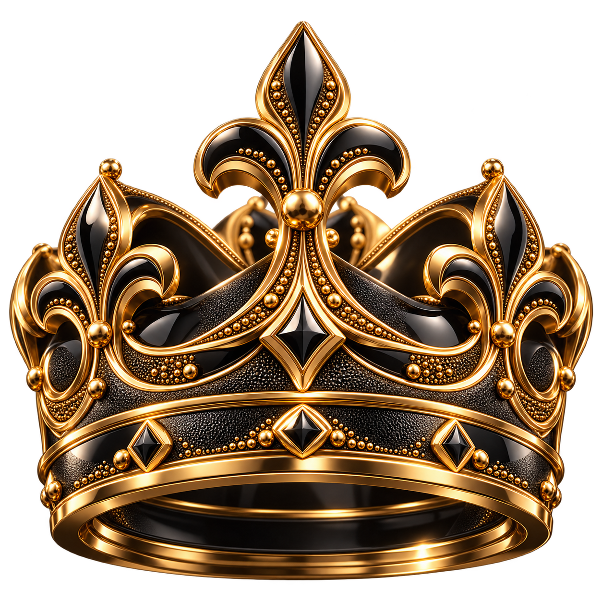
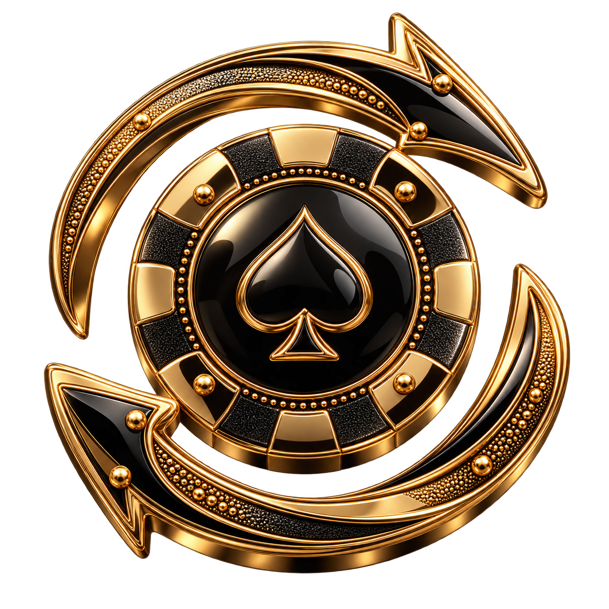

# LEVEL — значки достижений

Комплект из 38 сгенерированных значков для покерного клуба LEVEL.

- Изображения: [images](images), файлы `1.png`–`38.png` в порядке исходного списка.
- Формат: PNG, 1254 × 1254, прозрачный фон.
- Стиль: чёрный металл и эмаль, золотая отделка, мелкие рельефные детали, без мрамора.
- [Промпт и список сюжетов](LEVEL-prompts.txt).

Изображения созданы с помощью OpenAI imagegen.

## Примеры

| Первый стол | Первая победа | Не сдаюсь |
| --- | --- | --- |
|  |  |  |
